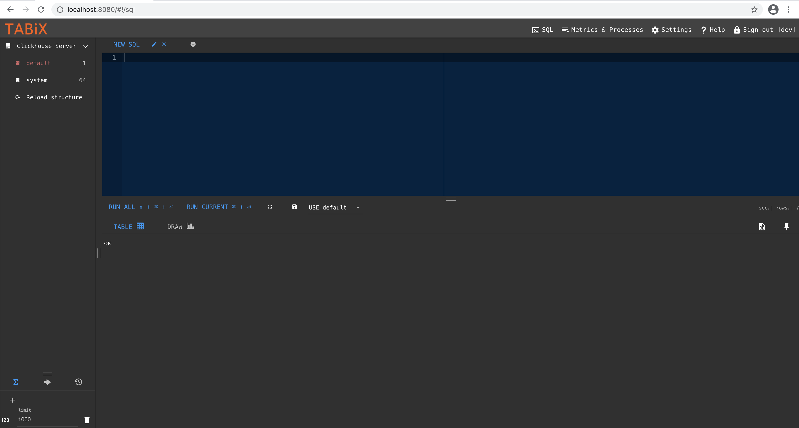

# Liquibase vs ClickHouse

I wanted to run a column database inside AWS for the storage of click data for a personal project. The quantity of data is initially small, but I wanted to be able to scale it up if I needed it to.  Whilst Redshift is a viable technology choice, it starts at $0.25/hour, so the cost soon adds up. Running something on EC2 is more to my liking (I also want to be able to turn it off completely when I'm not using it) - so, enter ClickHouse.

[ClickHouse](https://clickhouse.tech) is a column-oriented database which was developed by Yandex. It will happily deal with petabytes of data and is blindingly quick. So quick, in fact, that ClickHouse will leave Redshift for dust: here is the [benchmark](https://altinity.com/blog/2017/6/20/clickhouse-vs-redshift). There are also a useful discussion in this [blog by Ned McClain here](https://www.nedmcclain.com/why-devops-love-clickhouse/).  Whilst running a production instance at scale is always involved and you may wish to look at a managed service ([Altinity](https://altinity.com/cloud-database/?/) offer one), if you just want to run ClickHouse on an EC2 instance for demo purposes, then it's available as a Docker image from [DockerHub](https://hub.docker.com/r/yandex/clickhouse-server/).

## Liquibase and the `liquibase-clickhouse` extension

Now, if we're going to set up a database, then we want to make sure that our database schema matches what our code expects it to be. We specifically do not want to have to log in manually and run data schema conversion commands.  That way lie tears, outages and late nights spent trying to fix things that haven't gone to plan. No, what we want is a scripted mechanism for applying schema changes in a controlled fashion.

[Liquibase](https://www.liquibase.org) is an opensource database schema management tool which does exactly what we want. It allows us to apply a sequence of changes to our database, where the changes may be specified in a number of formats, including SQL.  Sounds great, right?  Unfortunately, the ClickHouse homepage shows that ClickHouse is not a supported database.

There is a project on GitHub [here](https://github.com/MEDIARITHMICS/liquibase-clickhouse) which appears to be a Liquibase extension for ClickHouse, meaning we should be able to apply Liquibase database schema updates to ClickHouse. Caveat: if we can only work out how to use it, because there is zero documentation.  This blog post will show you how to do just that.

### Starting ClickHouse

Let's start ClickHouse and check that it starts ok:

```shell script
mkdir -p clickhouse_data
docker run  --ulimit nofile=262144:262144 --volume=$(pwd)/clickhouse_data:/var/lib/clickhouse -p 8123:8123 yandex/clickhouse-server

# now check status
$ curl -s http://localhost:8123/ping
Ok.

```

### ClickHouse UI

We want to be able to look at the database and see if our changes are applied ok, so let's now start up a web client for ClickHouse:

```shell script
docker run -d -p 8080:80 spoonest/clickhouse-tabix-web-client
```

Now we can browse to *http://localhost:8080* and see the UI - we will need to use the username `default` with no password in order to log in.  We'll get something that looks like the below:



### The `liquibase-clickhouse` extension

Getting this working took me an annoyingly long period of time.  We will execute Liquibase against our running ClickHouse database via a [Docker image](https://hub.docker.com/r/liquibase/liquibase).  In order for us to do this successfully, do the following;

1. Create a directory for Liquibase and the components we will use.

```shell script
# root directory for this tutorial
mkdir liquibase

# directory for our changesets
mkdir -p liquibase/changelog/sql
``` 

2. Now create the `liquibase-clickhouse` jar with all its dependencies. The source code is in GitHub here: https://github.com/MEDIARITHMICS/liquibase-clickhouse.

```shell script
# assumes we are in the liquibase top-level directory we created above. 
git clone git@github.com:MEDIARITHMICS/liquibase-clickhouse.git
cd liquibase-clickhouse
mvn package
```

3. Create the Liquibase root changeset file, which tells Liquibase what changes to make to our database. We are going to put all the changes in a series of files within a subdirectory, one change per file, so this root changeset file is simply a pointer to the other changes.  Create a file at `liquibase/changelog/root-changelog.xml`:

```xml
<?xml version="1.0" encoding="UTF-8"?>
<databaseChangeLog
xmlns="http://www.liquibase.org/xml/ns/dbchangelog"
xmlns:xsi="http://www.w3.org/2001/XMLSchema-instance"
xsi:schemaLocation="http://www.liquibase.org/xml/ns/dbchangelog
                      http://www.liquibase.org/xml/ns/dbchangelog/dbchangelog-3.8.xsd">

<includeAll path="sql/"/>

</databaseChangeLog>
```

Note how we refer to a sub-directory called `sql`: all of the changes we describe in this sub-directory will be applied to the database. The path refers to the *classpath* of the Liquibase binary, not a file path. Also, there is an option in the docs called `relativeToChangelogFile` for the `<includeAll>` node, but this appears not to work well - I couldn't get it to work and I could see some issues reported by others referring to it, so just keep as is for the moment.
 
4. Create a changeset that you wish to apply to the database: as a simple example, let's just create a dummy database. All of the files in the changesets directory will be applied in alphabetical order, so let's create `liquibase/changelog/sql/001-create-dummy-db.sql`

```text
--liquibase formatted sql
--changeset johndoe:create-dummy-database
CREATE DATABASE IF NOT EXISTS dummy;

```

The format is SQL, with some custom Liquibase headers at the top which tell Liquibase how we want to deal with the file - further details on Liquibase changeset syntax are [here](https://docs.liquibase.com/concepts/basic/changeset.html). Details on ClickHouse SQL syntax are [here](https://clickhouse.tech/docs/en/sql-reference/statements/create/database/).

5. Finally, we create a Liquibase properties file, describing to Liquibase how we will connect to our database. Create `liquibase/liquibase.properties`: 

```
changeLogFile: /liquibase/changelog/root-changelog.xml
url: jdbc:clickhouse://YOUR_LOCAL_IP_HERE:8123
username: default
password:
classpath: /liquibase/changelog
driver: shaded.liquibase.ru.yandex.clickhouse.ClickHouseDriver
databaseClass: liquibase.ext.clickhouse.database.ClickHouseDatabase
strict: true
``` 

Note that you need to add your computer's local IP so that your Liquibase container can connect to your ClickHouse database container: do not mistakenly use `localhost` here, as this file will be mounted inside a container. We add the directory containing the `sql` directory which contains our changesets to the classpath of Liquibase. We specify the standard JDBC driver for clickhouse, but because the plugin shades this into a different location, we need to specify the shaded package (`shaded.liquibase.ru.yandex.clickhouse.ClickHouseDriver`). Finally, we need to specify a class describing the ClickHouse database, which Liquibase will use when initialising the connection.

The classpath argument caused me no end of grief - there seems to be some funny behaviour around parsing classes when Liquibase starts up where it determines which databases it supports etc, and it seems to have trouble parsing classes within jars. Whilst I could specify the compiled jar in here, its classes are not picked up and Liquibase won't use the classes in it to connect to ClickHouse using the correct SQL syntax, so we will actually need to add the jar into the normal library path for ClickHouse using a bind mount in the next step.

6. Now we are in a position to start Liquibase:

```shell script
docker run -it --rm  -v $(pwd)/liquibase/changelog:/liquibase/changelog -v $(pwd)/liquibase/liquibase-clickhouse/target/liquibase-clickhouse-0.5.3-SNAPSHOT-shaded.jar:/liquibase/lib/clickhouse.jar liquibase/liquibase:3.10 --defaultsFile=/liquibase/changelog/liquibase.properties --logLevel=debug update 
```

**Of paramount importance:** ensure that the major version of the Liquibase container that you run matches the version of the Liquibase library used as a dependency on the `liquibase-clickhouse` jar you compiled. The latest version of Liquibase is `4.x`, which is NOT COMPATIBLE with this extension you just compiled (ask me how long I wasted finding this out...).  Also to note here: bind mount your compiled jar into the container, changing the version if it's named differently when you build it. 

If you follow these steps, you should see a long log from your running container, where Liquibase loads, parses your extension, connects to your running container and then applies every changeset to your database, followed by your container exiting cleanly. Repeated executions of this container will be idempotent.  Use the UI to confirm that your changes were applied correctly, or to test new changesets (this is why we write the changesets in SQL, by the way!).

# Further information

If you have any further queries, have comments or noticed something wrong then please give me a shout on [Twitter](https://twitter.com/john_tipper). 