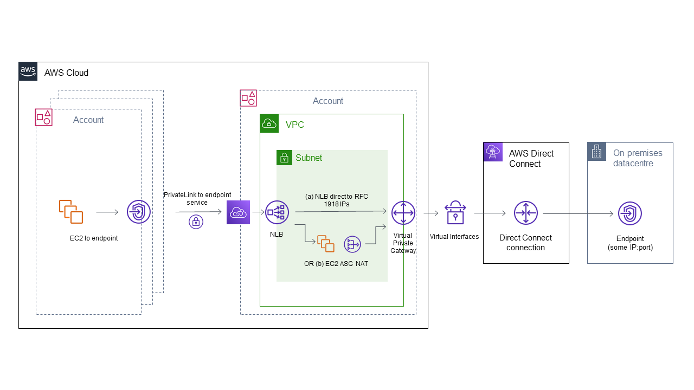

# Using AWS Direct Connect to access on-premises resources

[AWS Direct Connect](https://aws.amazon.com/directconnect/) is a means by which AWS may be connected to on-premises resources, such that the connection is secure and runs across the AWS network backbone, i,e. none of the traffic ever travels over the public internet. This means the connections are reliable and have deterministic latency - you're not subject to the vagaries of the general internet - and the connections are arguably more secure, provided that your trust model means you trust AWS.

The Direct Connect connection can enable connections from AWS to the on-premises network, or in the reciprocal direction.  If you have a minimum bandwidth requirement of 1Gbps, you can purchase the connection from AWS directly, or else you can buy a shared connection using a trusted AWS partner.  

What this connection actually represents is entirely up to you. Maybe you're wanting to connect an on-premises office network to some AWS resources. Equally, maybe you want to do something a bit more exotic, like connect AWS resources to private resources like trading connections to brokers using a protocol like the [Financial Information eXchange (FIX) Protocol](https://www.fixtrading.org/what-is-fix/). [BT Radianz](https://www.globalservices.bt.com/en/aboutus/celebrating-20-years-of-bt-radianz) is a network of thousands of brokers, institutions, exchanges and clearing and settlement houses. For example, perhaps you are building a financial SaaS and you want to interact with other participants - you might choose or be compelled to connect to your counterparties using a system like BT Radianz.  BT Radianz connects to AWS using Direct Connect, in that effectively the Radianz network sits behind the AWS Direct Connect connection like some third party on-premises network, and connections to Radianz counterparties are then routed through the BT Radianz via a series of NATs.  This is shown on the right hand side of the network diagram below.



## Sharing the Direct Connect connection

Imagine we have paid for a Direct Connect connection and resources in our AWS account can do things like make trades with brokers via Radianz. What happens if we now want to make this connection available to other AWS accounts? Maybe we just have different resources in other accounts that need to connect, or maybe we want to be able to package up this expensive connection to a broker or financial institution and offer it for sale to other people who are running resources in their own AWS accounts.

If you want to set up a Radianz connection, it'll take at least 30 days to do so. This might well become a pain point, in that you don't want to have to set up a Direct Connect connection for each of your AWS accounts that needs to connect. Nor do you want to add a 30+ day lead time to the onboarding of your clients to whom you're selling a broker connection. We have a Virtual Private Gateway inside our account that will route connections to our Radianz endpoint, so the question is, how can we share this with other accounts?

## VPC Peering

[VPC Peering](https://docs.aws.amazon.com/vpc/latest/peering/what-is-vpc-peering.html) is a connection between 2 VPCs. Could we connect the VPC which contains our Direct Connect connection to our FIX broker using peering? The answer is yes, maybe. There are some limitations to peering, listed [here](https://docs.aws.amazon.com/vpc/latest/peering/invalid-peering-configurations.html). The most obvious problem is that overlapping CIDR ranges are not supported. This is going to be a big problem if you want clients to connect to you - it's very possible that the CIDR range of the client's network overlaps with your VPC (and this is definitely going to be the case if you and the client put your resources in the default VPC). Let's assume we have overlapping CIDRs - what other option do we have?

## AWS PrivateLink

[AWS PrivateLink](https://aws.amazon.com/privatelink/) is a service which allows AWS accounts to connect to resources in a different account, such that the traffic between the two goes over the AWS backbone. Crucially, overlapping CIDRs are supported. Resources to be shared are placed behind a private Network Load Balancer and made available through an Endpoint Service.  Could we connect the VPC which contains our Direct Connect connection to our FIX broker using PrivateLink? The answer is yes, but probably not without a little networking magic.

### The problem with NLB Target Groups

An NLB target group can specify an IP range as their target, meaning connections on a given port will be routed to a particular IP range. The problem with respect to using the NLB to point at the Direct Connect connection is that [only the following IP ranges are allowed](https://docs.aws.amazon.com/elasticloadbalancing/latest/network/load-balancer-target-groups.html#target-type), as taken from the AWS docs:

> - The subnets of the VPC for the target group
> - 10.0.0.0/8 (RFC 1918)
> - 100.64.0.0/10 (RFC 6598)
> - 172.16.0.0/12 (RFC 1918)
> - 192.168.0.0/16 (RFC 1918)
> 
> **Important**
> You can't specify publicly routable IP addresses.

The problem? Unless the IP address you have been given by BT Radianz (or more generally, the on-premises IP that you are connecting to) is a private IP address, you can't specify that IP address as a target of an NLB.  If you do have a private IP you want to route to, then your networking looks like path (a) in the diagram and you're probably not reading this document anyway. But if you have been given a public IP that you need to connect to, how can you connect an NLB to this public IP?

### Using an ASG to perform NAT

Let's solve the problem by putting an Auto Scaling Group of EC2 instances as the target of the NLB.  To achieve high availability, we will want to put the ASG across at least 2 AZs, ensure the size of the ASG is at least 2 and ensure the NLB is listening across the 2 AZs and has cross-zone load balancing enabling. A client resource (for example, an EC2 instance in a client account) will connect to the Endpoint in that account and the connection will go over the PrivateLink connection to the NLB and even if one of ASG EC2 instances goes down, your clients will still be able to connect.

The ASG EC2 instances need to perform Network Address Translation (NAT) and redirect packets targeted at them to our target FIX endpoint IP and port.  This is shown as flow (b) in the networking diagram. How do we actually perform the NAT? 

### Networking Magic, a.k.a. iptables

I'm not a networking expert by any means, so [iptables](https://en.wikipedia.org/wiki/Iptables) is magic as far as I'm concerned. NAT is the `re-writing the source and/or destination addresses of IP packets as they pass through a router or firewall` and there's a nice introduction to the magic of how Linux does NAT [here](https://www.karlrupp.net/en/computer/nat_tutorial).

Imagine we have an EC2 server in our ASG running Amazon Linux 2 and acting as a target of the NLB, i.e. it will receive packets on a particular port(s) as specified in the target group(s).  We want it to reroute packets received on those ports to the target IPs and ports. We can do this by running as root:

```shell
echo "1" > /proc/sys/net/ipv4/ip_forward
sysctl -p

iptables -t nat -A PREROUTING -p tcp --dport c -j DNAT --to-destination {TARGET_IP}:{TARGET_PORT}
```

where `{PORT_IN}`, `{TARGET_IP}` and `{TARGET_PORT}` are the port that the server is receiving packets from the NLB, the IP that we are forwarding packets to and the port that we are forwarding to, respectively.

If we want to test this on the server, by using `curl` perhaps like this (assuming that the server will respond with something):

```shell
curl -s -v {TARGET_IP}:{TARGET_PORT}
```

then we'll get nothing, it'll look like a black hole.  We need to use the `OUTPUT` chain to perform manipulation of packets which are generated locally, e.g. via `curl`:

```shell
iptables -t nat -A OUTPUT -p tcp --dport {PORT_IN} -j DNAT --to {TARGET_IP}:{TARGET_PORT}
```

Finally, we need to pretend the packets came from us, not the NLB, and return the response packets to the NLB when we get them:

```shell
iptables -t nat -A POSTROUTING -j MASQUERADE
```

If you do the above, you can use `curl` or `telnet` to connect to your Direct Connect connection to test connectivity, plus connections received from the NLB will also get through, provided that the NLB health checks are set to use the traffic port (i.e. the NLB health check will speak to the ASG EC2 instances which will forward to the Direct Connect connection endpoint and provided this responds, the response will be returned to the NLB via the ASG EC2 instance and the health check will pass).

We're going to want to make the forwarding happen if the servers get restarted, whereas just running `iptables` commands are not persisted over system restarts. Let's use `rc.local`, which is a file that will be executed if it exists and is executable.

```shell
# save the result of running the iptables commands
iptables-save > /etc/iptables.conf

cat << EOF >> /etc/rc.d/rc.local
iptables-restore < /etc/iptables.conf
EOF

chmod +x /etc/rc.d/rc.local
systemctl enable rc-local
systemctl start rc-local
```

### User Data

Our final User Data for our ASG launch Configuration will look something like this, where there is a pseudo-code loop which will vary according to the number of Direct Connect connections you need to forward to:

```shell
echo "1" > /proc/sys/net/ipv4/ip_forward
sysctl -p

# for each {PORT_IN} we are listening on and {TARGET_IP}:{TARGET_PORT} we wish to redirect to
iptables -t nat -A PREROUTING -p tcp --dport c -j DNAT --to-destination {TARGET_IP}:{TARGET_PORT}
iptables -t nat -A OUTPUT -p tcp --dport {PORT_IN} -j DNAT --to {TARGET_IP}:{TARGET_PORT}
# end for loop

iptables -t nat -A POSTROUTING -j MASQUERADE

iptables-save > /etc/iptables.conf

cat << EOF >> /etc/rc.d/rc.local
iptables-restore < /etc/iptables.conf
EOF

chmod +x /etc/rc.d/rc.local
systemctl enable rc-local
systemctl start rc-local
```

### Limitations

Note that any AWS account can connect to any of the ports we have exposed on our NLB, so you can lock these down using a Security Policy on the PrivateLink Endpoint inside the client account, but not from account that owns the PrivateLink Endpoint Service and NLB.

Also, note that connections can only be initiated from the client accounts - it is not possible for connections to be initiated from the on-premises network or from the PrivateLink account and connect to the client accounts. This may very well be a good thing from a security and compliance/auditing perspective.

# Further information

I'm far from a networking expert, so if you have any further queries, have comments or noticed something wrong then please give me a shout on [Twitter](https://twitter.com/john_tipper). 